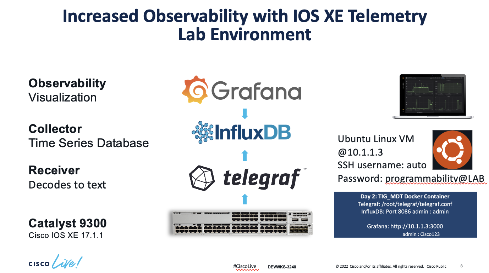
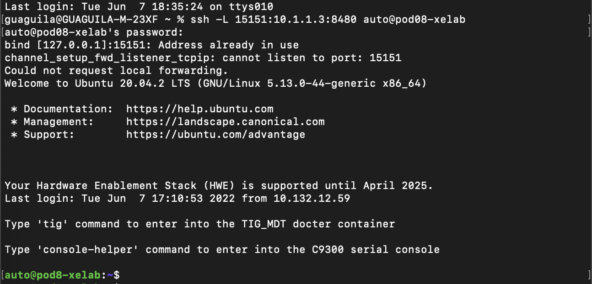
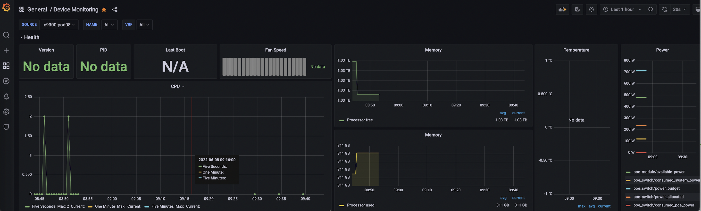

# CLive2022_DEVWKS-3240

# Lab Introduction
To access the lab, you will need to SSH to the VM specific host. From the VM host you will have access to the switch and the remaining software dependencies for the lab. Please find below the actual lab environment and instructions. 

# Lab environment

# Accessing the lab environment 
Identify your pod# and log into your respective pod# using SSH:

Note: Use your pod number in the # symbol for the SSH command

ssh -L 15152:10.1.1.3:3000 -L 15151:10.1.1.3:8480 auto@pod#-xelab

Password: programmability@LAB

Once you logged into the VM, you should be able to see fhe following prompt:

# Telnet into the Catalyst 9300
From the VM prompt, enter the following commands to Telnet into the Catalyst 9300. We have DNS naming configured so we wont use an IP address but an actual name. 

auto@pod#-xelab:~$ telnet c9300

user: admin

Password: Cisco123

# Configuring Telemetry Subscriptions on the Catalyst 9300
1-Every process that you need to monitor from the device requires a subscription. We will create for subscriptions to monitor the following aspects: CPU, Power, Memory and Temperature.

2-Configure the type of encoding, in our case is: ‘encode-kvgpb’

3-YANG Push can be used to monitor configuration or operational datastore changes. We will use: ‘ stream yang-push’ 

4-Periodicity. Specify how frequently you want to send the traffic (in milliseconds) and the receiver of the traffic.

5-Include the receiver of the traffic, in this case it is the switch: 10.1.1.5. 

Copy&paste or enter the following commands, exactly as they appear on the Catalyst 9300:

configure terminal

telemetry ietf subscription 1010

 encoding encode-kvgpb
 
 filter xpath /process-cpu-ios-xe-oper:cpu-usage/cpu-utilization/five-seconds
 
 source-address 10.1.1.5
 
 stream yang-push
 
 update-policy periodic 2000
 
 receiver ip address 10.1.1.3 57500 protocol grpc-tcp

telemetry ietf subscription 1020

 encoding encode-kvgpb
 
 filter xpath /poe-ios-xe-oper:poe-oper-data
 
 source-address 10.1.1.5
 
 stream yang-push
 
 update-policy periodic 2000
 
 receiver ip address 10.1.1.3 57500 protocol grpc-tcp
 

telemetry ietf subscription 1030

  encoding encode-kvgpb
 
  filter xpath /memory-ios-xe-oper:memory-statistics/memory-statistic
 
  source-address 10.1.1.5
 
  stream yang-push
 
  update-policy periodic 2000
 
  receiver ip address 10.1.1.3 57500 protocol grpc-tcp
 

telemetry ietf subscription 1040

 encoding encode-kvgpb
 
 filter xpath /oc-platform:components/component/state/temperature
 
 source-address 10.1.1.5
 
 stream yang-push
 
 update-policy periodic 2000
 
 receiver ip address 10.1.1.3 57500 protocol grpc-tcp
 
 
 
 
 # Increased Observability with IOS XE Telemetry displayed in Grafana

Grafana is an open source solution for running data analytics, pulling up metrics selective metrics out of the huge amount of data that we are monitoring daily from our devices and apps with the help of customizable dashboards.

Grafana connects with every possible data source or databases such as Graphite, Prometheus, Influx DB, ElasticSearch, MySQL, PostgreSQL etc. In this case we will extract the information the subscriptions that were created on the switch. This data has been  sent from the switch to Influx DB. Now we will display that into Grafana dashboards.

Grafana being an open source solution also enables us to write plugins from scratch for integration with several different data sources.

## Open the Grafana dashboard 
Open http://localhost:15152/

Username: admin 

Password: Cisco123

