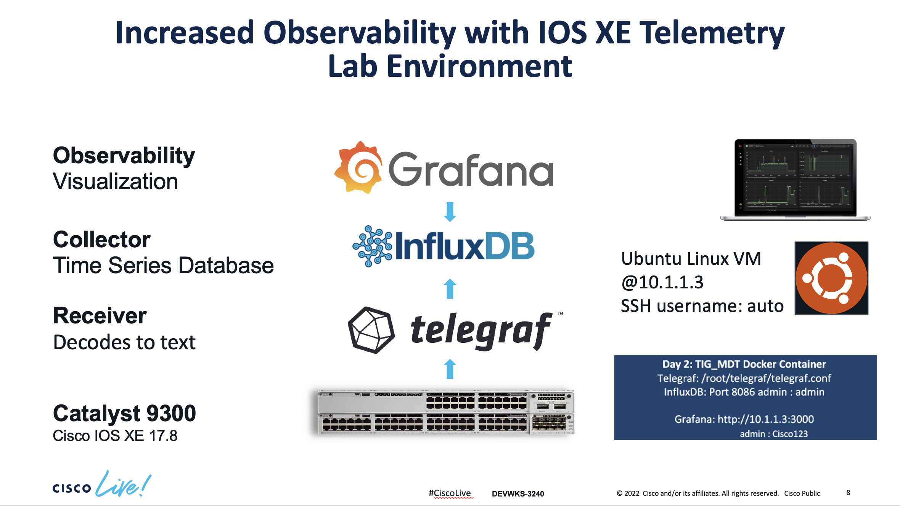
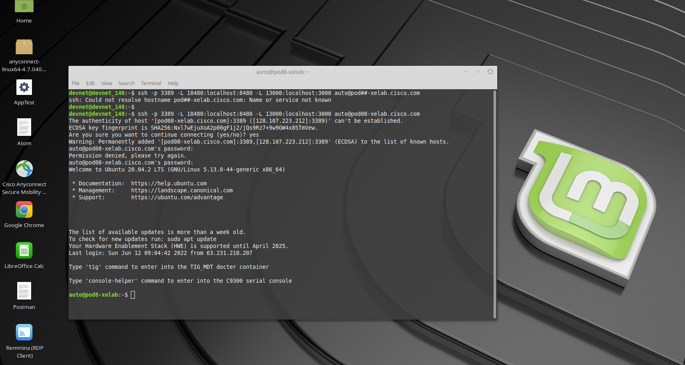
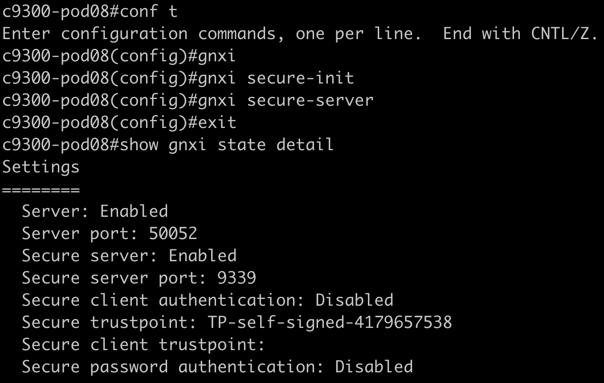
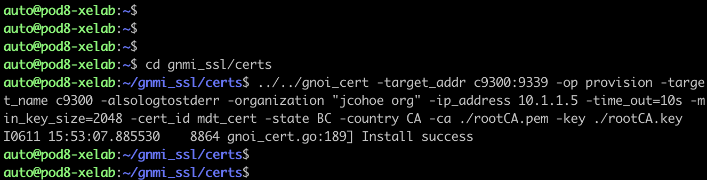

# CLive2022_DEVWKS-3240
## Version 17.8

# Lab Introduction
This lab focus on the configuration of a Catalyst 9300 switch and and a Ubuntu VM machine that has the necessary software dependencies to reproduce the MDT contents reviewed during the presentation. 

You will access the lab via SSH. Please find below the actual lab environment and the instructions to continue. 


# Lab Environment



# Lab Configuration Scope

## gNOI Certificate Management Client

We are going to shield the switch to VM communication using certificates. A simple shell binary that performs Certificate Management client operations against a gNOI Target complete the operation.

### Certificates

Only the Root certificate and private key are required for this client. The client will:

* generate a client certificate for establishing the connection to the Target

* sign target signing requests for installing or rotating certificates on the Target

The client certificates can also be provided to establish the connection to the target and will be used instead.

For the sake of brevity, we will just take care of the following aspects of this configuration: 1) the GNXI switch configuration and 2) the certificate provision on the VM. 

## MDT Subscription Configuration


# Accessing the lab environment 

1. Identify your pod#.
 
2. Open two terminal windows and SSH to both. One window will be used to configure the VM. The second window is for telnet access into the C9300.

3. To SSH into the devices, copy/paste the below line into each of the terminal sessions. Replace the ## symbol on the SSH command with your pod number. Password: Use the password given to you by the facilitator.

```ssh -p 3389 -L 18480:localhost:8480 -L 13000:localhost:3000 auto@pod##-xelab.cisco.com```

    Once you logged into the VM, the first time you login, you'll see this question:

`Are you sure you want to continue connecting (yes/no/[fingerprint])?` 

Type, `yes` to continue 

After you approve the entry you should be able to see the following prompt:



4. Telnet into the Catalyst 9300 into the second window that you opened before. Use the following credentials: admin / Cisco123


5. Once you finished accesing via SSH and telnet into the VM and the switch respectively, this is how you should see them:


# Enhanced security via certificates (gNOI) for Model-Driven Telemetry

## GNXI configuration on the Catalyst 9300

We will start by configuring GNXI on the Catalyst 9300 switch and then check its operational:




Type or copy/paste the following CLI commands into the switch:
```
conf t
gnxi
gnxi secure-init
gnxi secure-server
exit
show gnxi state detail
```


You have now configured gNMI and verified that it is operational. Turn on the terminal monitor now so that events that happen next can be seen in real time on the C9300 terminal window. Enter the following command to enable terminal monitor: ***term mon***

Now lets turn to the Linux VM terminal to install the certificates onto the C9300 from the VM.

## Certificate provisioning on the Virtual Machine

Use the 2nd terminal window to perform the following tasks in the linux terminal.

Go into directory ***/home/auto/gnmi_ssl/certs*** then run the gnoi_cert command to install the certificate.

Copy and paste the following command exactly as it is. Make sure you are on the correct directory before.

```
cd gnmi_ssl/certs/
../../gnoi_cert -target_addr c9300:9339 -op provision -target_name c9300 -alsologtostderr -organization "jcohoe org" -ip_address 10.1.1.5 -time_out=10s -min_key_size=2048 -cert_id mdt_cert -state BC -country CA -ca ./rootCA.pem -key ./rootCA.key
```



This is going to install the certificate on the switch fromthe VM with the name "mdt_cert" that was specified (certificate for model driven telemetry)


Verify the certificates were provisioned and installed on the Catalyst 9300

One way to confirm the certificates installation is to examine the log file by running ***show log*** however since the terminal monitor is already enabled the relevant log messages are already displayed on the screen.


Use can filter the log to catch the specific message that we are looking for with the following command:
```C9300#show log | i PKI```

When gNOI cert.proto install operation is succesfull there will be a log message similar to “PKI-6-TRUSTPOINT_CREATE” which is seen on the C9300 terminal window.


Verify the certificates are in use now.


```C9300#show gnxi state detail ```

Note the 'Secure trustpoint' change from "Self-Signed" to the actual certificate name (mdt_cert) that was provisioned from the VM. 


# Configuring Telemetry Subscriptions on the Catalyst 9300

The next step is configure the telemetry subscriptions. This consists of several configuration steps:

1. Every process that you need to monitor from the device requires a subscription. We will create four subscriptions to monitor the following aspects: CPU, Power, Memory and Temperature.

1. In our case, the type of encoding is: ‘encode-kvgpb’

1. YANG Push can be used to monitor configuration or operational datastore changes. We will use: ‘ stream yang-push’ 

1. Periodicity. Tells how frequently we want to send the traffic (in milliseconds) to the receiver of the traffic.

1. Specify the receiver of the traffic, in this case is the switch: 10.1.1.5. 

1. Copy & paste or enter the following commands, exactly as they appear on the Catalyst 9300:


```
configure terminal
telemetry ietf subscription 1010
encoding encode-kvgpb
filter xpath /process-cpu-ios-xe-oper:cpu-usage/cpu-utilization/five-seconds
source-address 10.1.1.5
stream yang-push
update-policy periodic 6000
receiver ip address 10.1.1.3 57500 protocol grpc-tcp

telemetry ietf subscription 1020
encoding encode-kvgpb 
filter xpath /poe-ios-xe-oper:poe-oper-data
source-address 10.1.1.5
stream yang-push
update-policy periodic 6000
receiver ip address 10.1.1.3 57500 protocol grpc-tcp

telemetry ietf subscription 1030
encoding encode-kvgpb
filter xpath /memory-ios-xe-oper:memory-statistics/memory-statistic
source-address 10.1.1.5
stream yang-push
update-policy periodic 6000
receiver ip address 10.1.1.3 57500 protocol grpc-tcp
 
telemetry ietf subscription 1040
encoding encode-kvgpb
filter xpath /oc-platform:components/component/state/temperature
source-address 10.1.1.5
stream yang-push
update-policy periodic 6000
receiver ip address 10.1.1.3 57500 protocol grpc-tcp
```

 
 
 
 # Increased Observability with IOS XE Telemetry displayed in Grafana

Grafana is an open source solution for running data analytics, it pulls up selective metrics out of the huge amount of data that we are ingesting daily from our devices and apps with the help of customizable dashboards.

Grafana connects with every possible data source or databases such as Graphite, Prometheus, Influx DB, ElasticSearch, MySQL, PostgreSQL etc. In this case we will extract the information from the subscriptions that were created before on the switch. This data has been sent from the switch to Influx DB. Now, we will pass this data into Grafana for visualization.

Grafana being an open source solution also enables us to write plugins from scratch for integration with several different data sources.

## Open the following browser URL to access the Grafana dashboard 
```http://localhost:13000/```

Username: admin

Password: Cisco123


The CPU Utilization streaming telemetry data, the average and current memory consumption patterns, the temperature levels (max, min, avg) and power readings that were configured earlier are now visible in the pre-configured charts. 

This shows the telemetry data that was configured earlier in this lab using Grafana for visualization of the data.


# Summary

On this lab we explore the capabilities of Increased Observability with IOS XE gRPC Dial-Out, Telegraf, InfluxDB, and Grafana - including the tig_mdt Docker container to enhance the management alternatives via MDT capabilities securely.
Cisco IOS XE is fully managed via YANG data models and the Model Driven Telemetry API's across the whole lifecycle. 


## Follow up on MDT
Please make sure to complete the session survey in the Cisco Events App.

Additional feedback is also being collected in the SmartSheet form during and after the event - please leave a comment on this lab at:

https://app.smartsheet.com/b/form/134240eac2d84a57acd4efc24fd8f3d0

Thank you!